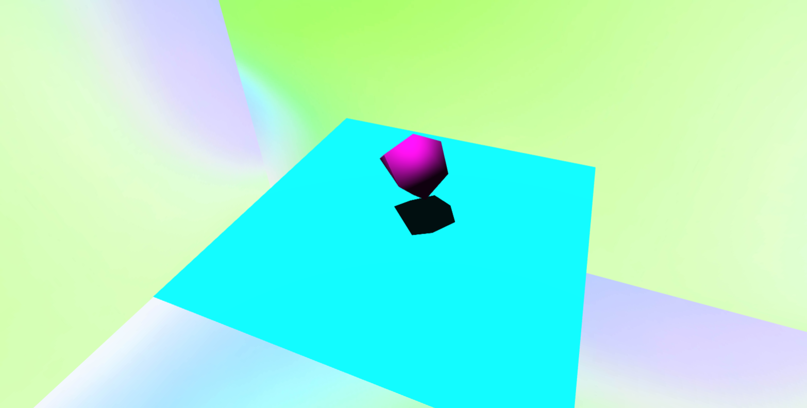

# Fundamentals of Three JS

### Approach:

Based on [SimonDev's Basics Tutorial]("https://github.com/simondevyoutube/ThreeJS_Tutorial_BasicWorld"), the approach for learning was:

1. Read through the original code, commenting what each line is doing.
2. Look up any function calls, properties or definitions that were unclear and add note in comments
3. The the code was understood well enough, use the code as a template and complete the following tasks:
   - Change the background texture (lines 91 - 100)
   - Change the type, position and color of the Primative that is rendered(lines 116 - 128)
   - Change the camera's base position (line 49)

### Usage:

1. Install webserver such as VSCodes LiveServer
2. Run index.html

### Controls:

The controls used are:

- left mouse click and hold: Pan
- mouse scroll wheel: Zoom (Pinch to Zoom on touchpad)
