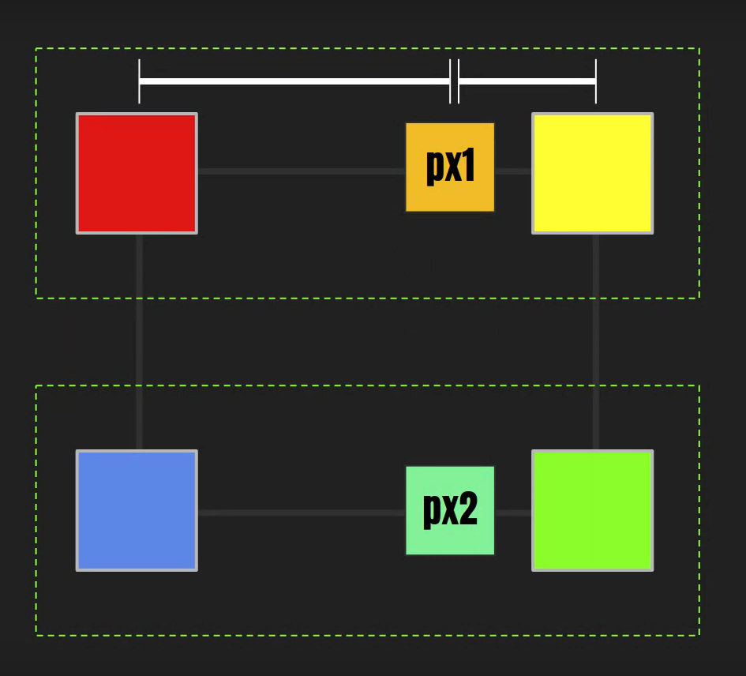
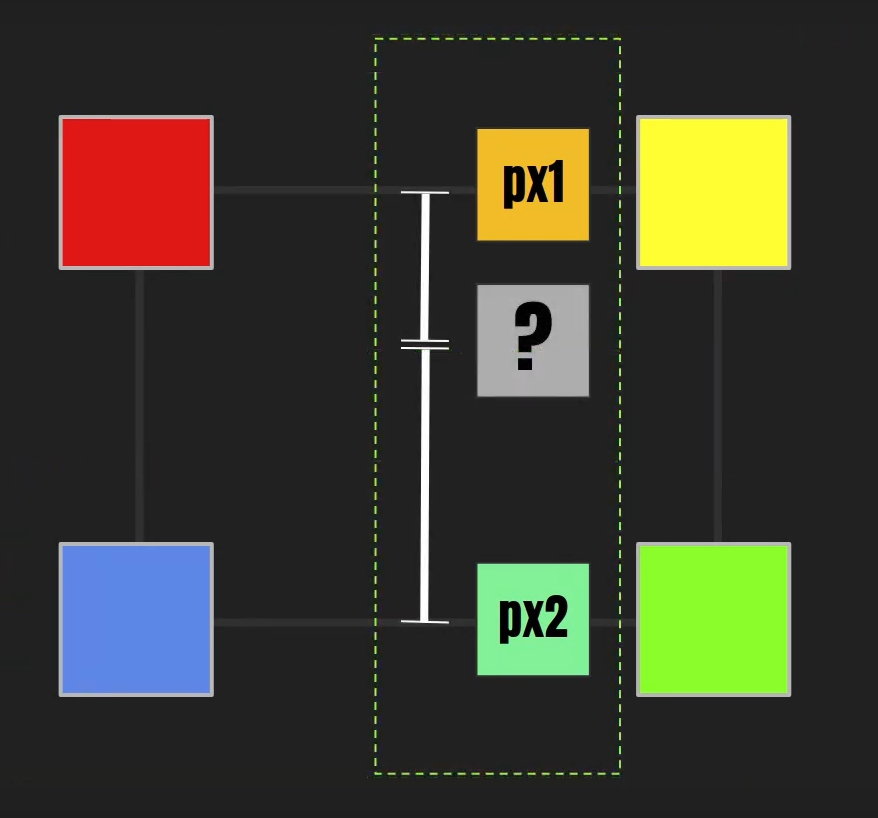

# 1. Procedural Terrain Generation

- heightmap generation
- vertex manipulation
- mesh generation
- texture generation
- SmoothStep Function (Ken Perlins improved version)
  Steps 1 and 2 | 3rd step
  :-------------------------:|:-------------------------:
   | 

- [Bilinear Filtering](https://en.wikipedia.org/wiki/Bilinear_interpolation):
  - in order to adjust between different size canvas' (Mesh and heightmap in this case) Bilinear Filtering performs 3 color blends. A kernel of 4 pixels averages the (top left, top right) and (bottom left, bottom right), then averages the two results. This is done for each pixel in the mesh.
